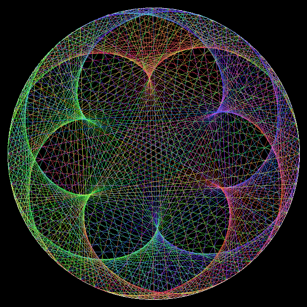

# cardioids

I first read about cardioids back in high school 35 + years ago and promptly forgot about them until today (Feb/5/2022) while digging around for interesting math and geometry ideas. I ran across [this site](https://arbitrarilyclose.com/2020/03/22/mathartchallenge-day-7-cardioids/). 

The reintroduction was so much simpler than the math I had to do all those years ago. It breaks it down into basic modulo math. So much different than the formulas I don't remember anymore. Feel free to go track them down. I'm not!

Enjoy the code. I hope you find it as entertaining as I have.